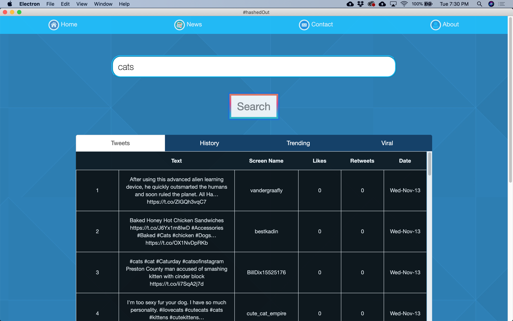
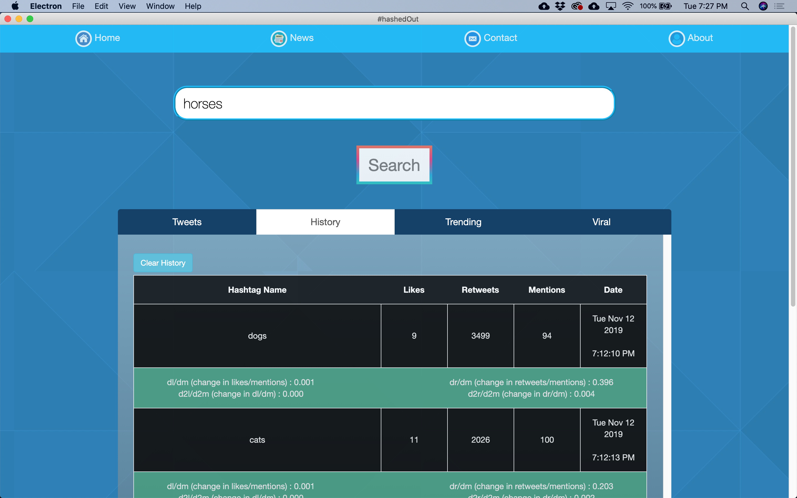
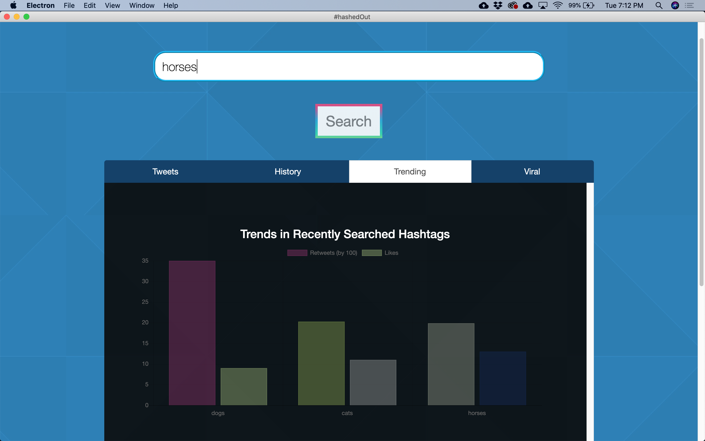
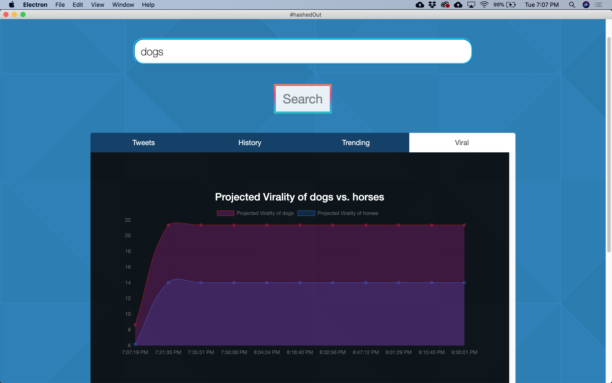

# 2019fall_groot

Authors: David Rainbolt, Andrew Berger, Winston Boyd, and Josh Herman

## About

This app is used to search Twitter's Hastags. It returns the searched hastags into a table. It also allows for a history of searches, and calculates data about the hastags as well.

## Using the App

1. Use 'npm start' to run the app.
2. Use the search bar and type in the word you want to look at. 
3. The 'tweets' tab of the main table will load a live list of every tweet using the hashtag you searched.
    

4. The history tab will show any past words you've searched, and will show that hashtag's rate of change,
    date posted, and likes and retweets.
    

5. The trending tab loads a bar graph with all your searched words. There, you can compare the popularity
    of all the words you've searched.
    
    
6. The viral page details the projected 'virality' or popularity of your tweet based on the rate of change formula.
    

## Installation

1. Install/Update NodeJS - https://nodejs.org/en/download/
2. Clone the repository
3. Install Dependencies - Run the command 'npm install' in your command prompt or terminal.
4. To run the propgram run the command 'npm start' in your command prompt or terminal.

## A note before running the program:

A file called config.js with a valid Twitter API key is required in order to interact with the Twitter APIs. This means searching will not work without this config.js file. Here's how the  config file look:

let twitterAPIKey = {  
    &nbsp;&nbsp;&nbsp;&nbsp;&nbsp;&nbsp;consumer_key: 'insert your consumer key here', 
    &nbsp;&nbsp;&nbsp;&nbsp;&nbsp;&nbsp;consumer_secret: 'insert your consumer secret here', 
    &nbsp;&nbsp;&nbsp;&nbsp;&nbsp;&nbsp;access_token_key: 'insert your access token key here', 
    &nbsp;&nbsp;&nbsp;&nbsp;&nbsp;&nbsp;access_token_secret: 'insert your access token secret here' 
} 
module.exports.twitterAPIKey = twitterAPIKey 

## Dependencies

The libraries used in this app are: Bootstrap, JQuery, table2csv, and Twitter's own javascript API.
